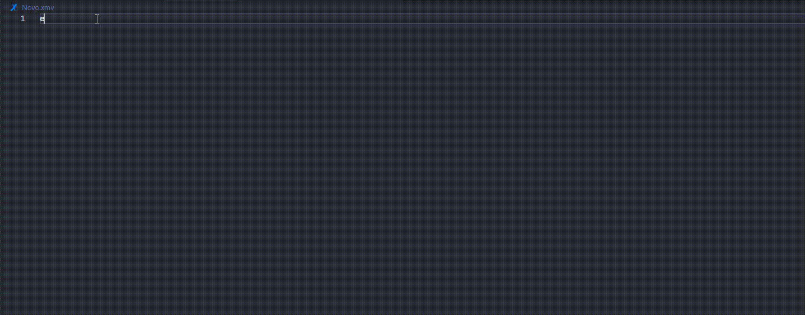
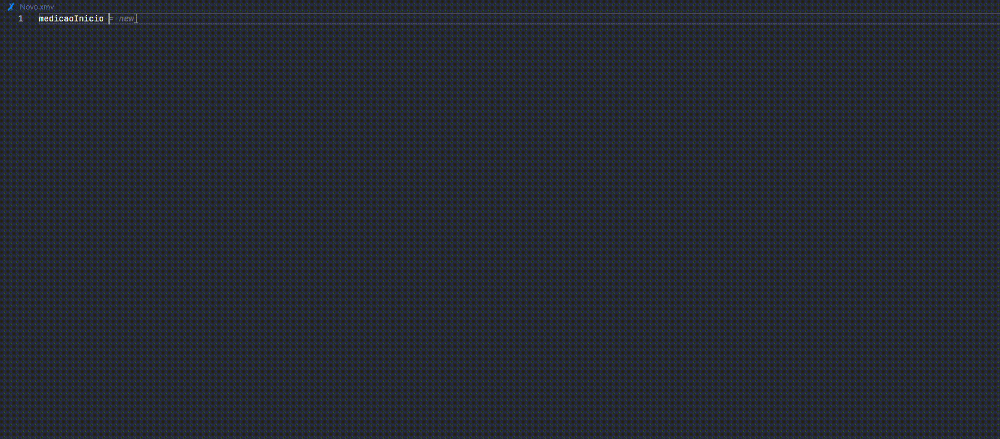
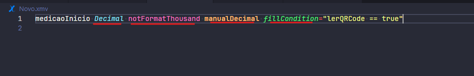
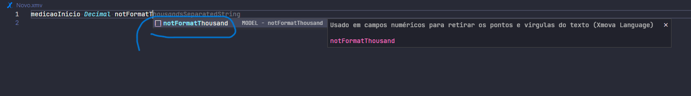
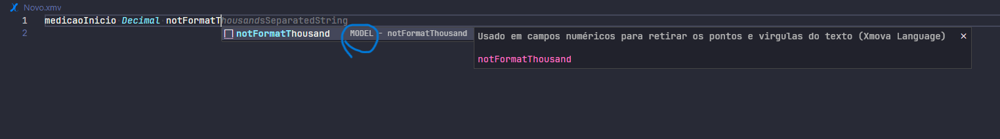
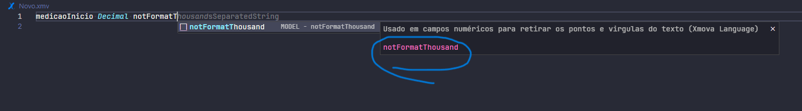
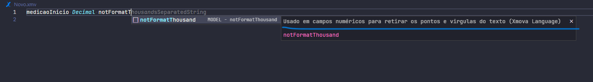

# Xmova Language

### Sugestão de Tema para melhorar a experiência: [Dracula Official](https://marketplace.visualstudio.com/items?itemName=dracula-theme.theme-dracula)

## Features

### Snippets e Palavras chaves:

---
---
---

---
---
---

---
---
---
### Retorno da Busca:

---
---
---
### Sugestão de Utilização:

---
---
---
### Código a ser Implementado:

---
---
---
### Documentação:

---
---
---
### Repositórios:
[Produção](https://github.com/RaphaelMolina/support_language_xmova/tree/main)

[Homologação](https://github.com/RaphaelMolina/support_language_xmova/tree/homol)